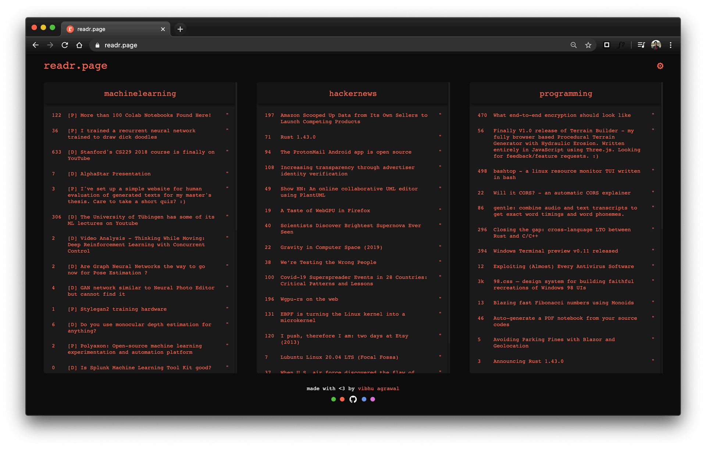

# [readr.page](https://readr.page)
A static feed aggregator for Hacker News and reddit written in Javascript. This is my daily driver for distraction free reading.


  
 
 #### Customizing feeds
 
The feeds can be customized using the settings icon at the top right. The input takes subreddits' names by design, but adds the HackerNews feed if "hackernews" is entered. To add the "hackernews" subreddit, just capitalize any characters in the input string (for example, you can enter "HackerNews") as the internal check is case-sensitive. The choice of feeds is stored in cookies.

 
---

 #### Customizing colors
 
Text color can be customized using the colored-circles at the bottom of the page. There are four colors available:
*  tomato `#FF6347`
*  orchid `#DA70D6`
*  cornflowerblue `#6495ED`
*  mediumseagreen `#3CB371`


 
---


 #### Adding custom colors
 
 As the color choice is stored in cookies, custom colors can be added using javascript:
 
 ```javascript
var color = "#ffffff";
var cookieExpiryLength = 10; // in days
createCookie("textColorOne", color, cookieExpiryLength);
```

Cookies can also be deleted using javascript to reset color to default:
 ```javascript
eraseCookie("textColorOne");
```
 
---

#### Support 
Reach out to me at one of the following places!  
  
Twitter: @vibhuagrawal  
Email: vibhu[dot]agrawal14[at]gmail  

